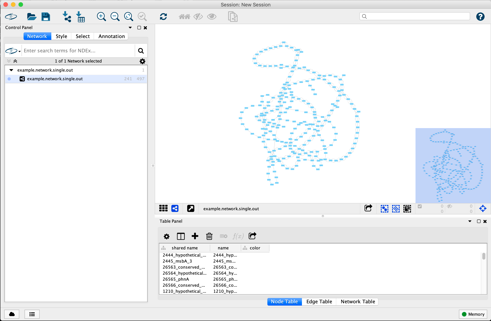
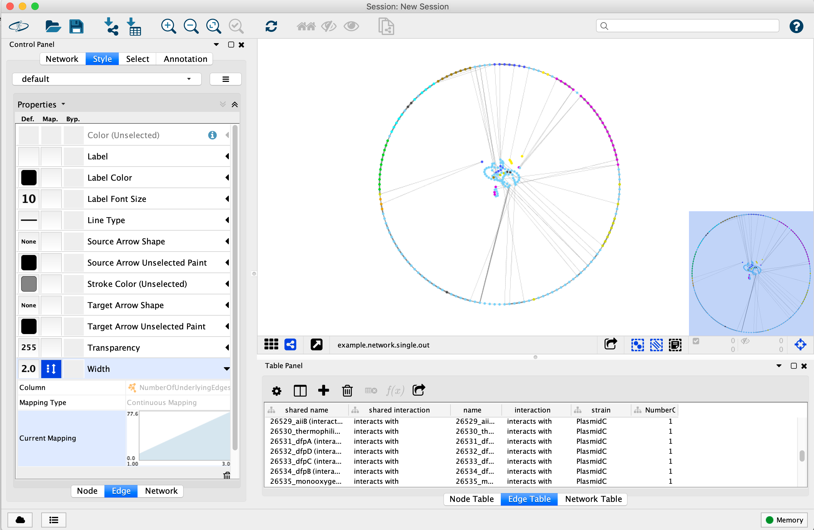
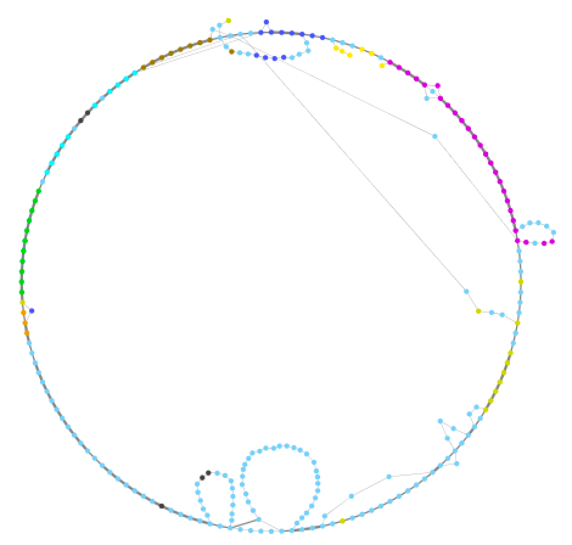

# Gene Synteny Graphs
## A step-by-step tutorial
This tutorial explains how to generate a gene synteny graph from a set of samples (a genomic region, plasmids, strains, etc.). It assumes a basic knowledge of running code from the command line.

## Necessary input files
To make a gene synteny graph, you need two things:
* Gene orders for each of your regions/plasmids/strains
* Ortholog clustering information grouping genes into clusters

Gene order information can come from annotated genbank files, or a list of locus tags in the correct order for each sample.

Ortholog clustering information can be the result of any clustering algorithm (typically from reciprocal BLAST searches and MCL clustering)
Common options include get_homologues or ROARY.

## Prepare a table linking genes (locus tags) to ortholog clusters

The example file "" contains a table linking locus tags from each sample to an ortholog cluster (generated using get_homologues).

To make this table from your own data, you can use example code from the "" script. If you only have a folder full of fasta format files containing clusters, parse that using the first script. If you have output from get_homologues, the second option is much faster.

## Make a gene synteny graph
The next step is to generate the gene synteny graph. This graph links pairs of syntenic genes using the shared ortholog cluster names.
When samples have the same gene order, they will link the same ortholog clusters. When gene order differs between samples, new paths will appear in the network.

Gene synteny networks can be produced in any number of ways, and the provide script is one example. The logic behind the script is to go through all pairs of syntenic genes. For each gene, identify which ortholog cluster it belongs to. Then add an edge to the network linking the two ortholog clusters representing the syntenic genes. For "sif" format networks, this involves just outputting a tab-delimited line containing the two nodes (ortholog groups). 

This script is an example and should be modified to fit your dataset and needs. In the example, single contig input files are assumed to be circular plasmids. If this is not the case for your samples, the code linking the first and last genes should be omitted. Likewise, if you have a list of gene order rather than genbank files, the code will need to be changed to accommodate this. In its current form, the script will output multicopy genes by including the locus_tag with the cluster name in order to simplify the network. If you do not want that, remove the corresponding line in the code. Additionally, samples with multiple contigs result multiple unconnected networks as the true order of contigs is not known.

The script "" will output a gene synteny graph in the common network "sif" format. This script takes as input annotated genbank files for each sample (example data PlasmidA.gbk, PlasmidB.gbk, and PlasmidC.gbk) and a table linking ortholog clusters (first column) to locus tags (any other column, separated by tabs) (example file ""). Run the script from the command line:

An output file (example.network.out) in sif format will be produced.

## Visualize the graph with Cytoscape
Open Cytoscape on your Mac or PC.

File -> Import -> Network from file...

choose example.network.out

Make sure the "gene1" and "gene2" columns have green or orange circles above them (indicating those are the nodes ot be connected). All other columns are treated as edge annotations.

File -> Import -> Table from file...

choose gene_color_table.txt

Make sure the "node" column is the key node (has a key above it)

You won't see any changes yet until will change the network style.

Click on "Edge Table" at the bottom of the main window. Select all nodes in your reference plasmid (in the example choose PlasmidA)
You can do this quickly by clicking on the first edge for PlasmidA, scroll down, then hold shift and click on the last edge for PlasmidA.

Right click and select "Select edges from highlighted rows"

Then in the main menu select:

Select -> Nodes -> Nodes connected by selected edges

You should have a subset of the nodes highlighted in yellow. These are the nodes from PlasmidA.

Select
Layout -> Settings...

In the window that appears, select "Attribute Circle Layout" and make sure the option "Layout only selected nodes:" is selected. Change "circle size" to 600. Click "Apply Layout" to apply the circle layout then click "Done"

Click anywhere in the window to deselect the nodes that are highlighted.

Select
Edit -> Remove Duplicated Edges...

In the window that appears, select the network (example.network.single.out)
Select the options "Ignore edge direction" and  "Create an edge table column with number of duplicate edges" before clicking OK.

In the control panel click the "Style" button. With "Node" selected at the bottom, click the arrow next to "fill Color". Next to "Column" click on the area that says "-- select value --" and change the value to "color" (which is one of the columns from our input table). Change "Mapping Type" to "Passthrough Mapping" which uses the raw value as the color specification.

Click on the square shape next to the "Shape" option and select the "Ellipse" option and click apply.

Select "Lock node width and height" to keep them as perfect circles.

Click on the number next to the "Size" option (default is 35.0) and change it to 150.

Click on the "Edge" option at the bottom to modify the edge style.

Click on the arrow next to "Width" and change the Column to "NumberOfUnderlyingEdges" which is the column created when we removed duplicate edges. Change "Mapping Type" to "Continuous Mapping". You can change how it scales line width by clicking on the graph in the Current Mapping section.

You can change any other visualization options depending on your dataset and what you want to show. The final step for our plasmid example is to manually change the layout of nodes that are not found in the reference strain. Click and drag on nodes to move them closer to where they appear in the reference.

You may see some nodes that are only connected to one other node. These are nodes that lie at the end of contigs near contig breaks.

